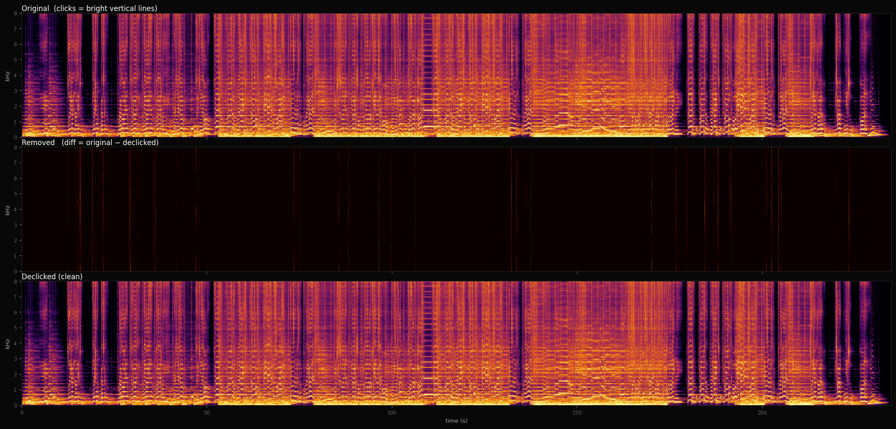

# suno-declicker

Removes the click/tick audio artifacts found in songs generated by **Suno AI v5.5** (and earlier versions).

## The problem

Suno v5.5 occasionally injects ultra-short broadband spikes into generated audio — audible as a sharp click or tick, typically landing on vocal consonants ("tr", "st", "k"). They are under 0.3 ms long, very loud relative to the surrounding audio, and broadband (all frequency bins spike at once).

## How it works

**Detection** combines three independent filters — a candidate must pass all three to be flagged as a click:

1. **Local amplitude ratio** — finds samples significantly louder than their 10 ms context window. Adaptive per-region so quiet passages are not ignored.
2. **Spectral fingerprint** — compares the spike's frequency profile against confirmed Suno v5.5 artifacts using cosine similarity. Musical transients (hi-hats, snares, guitar picks) score low and are skipped.
3. **Spectral flatness gate** — clicks spread energy uniformly across all frequencies (flatness ≈ 0.8–0.9). Music has concentrated energy (flatness ≈ 0.05–0.3). A high-flatness spike that is also amplitude-elevated is flagged as a click.

**Repair** uses a per-bin spectral magnitude gate:
- For each click frame in the STFT, the expected per-bin magnitude is interpolated from the two nearest clean frames on either side.
- A per-bin gain `g[f] = min(1, expected[f] / actual[f])` suppresses only the inflated bins — the original phase is fully preserved, so there is no phasing "gulp".
- Gain never amplifies — legitimate transients louder than their neighbours are left untouched.
- Three repair passes are run: residual clicks that survive pass 1 are caught in passes 2–3.

The original file is **never modified**. All repairs are written to a new copy.

## Results

3-panel spectrogram comparison — same song, full duration:

- **Top**: original (clicks visible as bright vertical lines)
- **Middle**: diff (original − declicked) — shows only what was removed
- **Bottom**: declicked output



The middle panel is nearly black across the full 3m 54s song, with isolated bright lines exactly at the click positions — confirming that only the clicks were touched and nothing else was altered.

## Quick start (wizard)

```bash
python3 suno_declicker.py
```

The wizard guides you through the two files you need:

1. **Instrumental stem** — exported from Suno Studio with beat grid snap **OFF** (snap ON causes timing drift). Requires Suno Pro, approx. 10–20 credits.
2. **Original song** — the full mix with the clicks.

It creates a named folder, asks you to drop the files in, then runs the declicker and saves `<song name>_declicked.mp3`.

## Command line

```bash
# With instrumental stem (recommended — stem guides click isolation in busy passages)
python3 suno_enhance.py song.mp3 --instrumental song-instrumental.mp3 --repair-mode median --out song_clean.mp3

# Standalone — no stem needed, spectral gate only
python3 suno_enhance.py song.mp3 --out song_clean.mp3

# Dry run — detect and list clicks only, no output saved
python3 suno_enhance.py song.mp3 --dry-run
```

After processing, the script asks:

```
Show spectrogram comparison + audio preview? (y/N):
```

Answering `y` generates a 3-panel comparison PNG (saved next to the output) and plays the top 5 loudest click regions — original then declicked — so you can hear the difference directly.

## Options

| Flag | Default | Description |
|------|---------|-------------|
| `--instrumental` | none | Instrumental stem — improves click isolation in busy passages |
| `--repair-mode` | `spectral` | `gate` (recommended standalone), `median` (with instrumental) |
| `--threshold` | `5.0` | Amplitude ratio to flag a candidate. Lower = catches more subtle clicks. |
| `--similarity` | `0.70` | Min spectral fingerprint match (0–1). Raise to reduce false positives. |
| `--passes` | `3` | Number of repair passes |
| `--out` | `<input>_enhanced.mp3` | Output file path |
| `--dry-run` | off | Detect and list clicks only — no file saved |
| `--no-compare` | off | Skip the spectrogram comparison prompt |

## Example terminal output

```
━━━━━━━━━━━━━━━━━━━━━━━━━━━━━━━━━━━━━━━━━━━━━━━━━━━━━━
  suno-enhance
━━━━━━━━━━━━━━━━━━━━━━━━━━━━━━━━━━━━━━━━━━━━━━━━━━━━━━
  Input  : My Song.mp3
  Steps  : declicker × 3
  Output : My Song_enhanced.mp3
━━━━━━━━━━━━━━━━━━━━━━━━━━━━━━━━━━━━━━━━━━━━━━━━━━━━━━

  44100 Hz | 2ch | 234.9s

  [Pass 1/3] Declicker
        Found 69 click(s):

     #      Time      Dur    Match
  ────  ────────  ───────  ───────
     1  00:12.49   0.18ms    0.839
     2  00:15.79   0.11ms    0.856
     3  00:15.84   0.11ms    0.802
    ...

        Repairing with per-bin spectral magnitude gate...
        Done.

  [Pass 2/3] Declicker
        Found 17 click(s).
        Done.

  [Pass 3/3] Declicker
        Found 2 click(s).
        Done.

  Original untouched : My Song.mp3
  Enhanced copy saved: My Song_enhanced.mp3
━━━━━━━━━━━━━━━━━━━━━━━━━━━━━━━━━━━━━━━━━━━━━━━━━━━━━━
```

## Requirements

- Python 3.8+
- ffmpeg (`brew install ffmpeg` / `apt install ffmpeg`)

```bash
pip install numpy soundfile scipy matplotlib sounddevice
```

## Tuning

- **Remaining clicks** → lower `--threshold` (try `4.0`) or add `--instrumental`
- **Musical damage** → raise `--threshold` (try `6.0`) or raise `--similarity` (try `0.80`)
- **Too many false positives** → raise `--similarity` to `0.80–0.85`

## Bonus: spectrogram viewer

`spectrogram_loop.py` — a real-time looping spectrogram with audio sync, useful for locating clicks visually before and after repair:

```bash
python3 spectrogram_loop.py song.mp3 10 20   # loop 10s–20s
```

Press Q or Esc to quit.

## License

MIT
